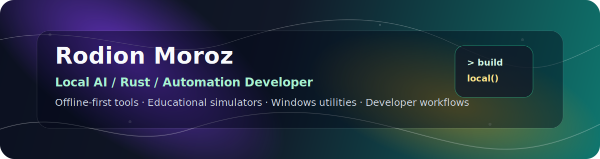
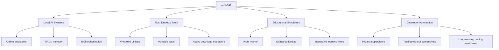

<div align="center">



<br />

[](https://github.com/radik097)
[](#)
[](#)
[](#)

</div>

---

## About

I build **offline-first AI tools, Rust desktop utilities, educational simulators, and automation systems**.

My current direction is practical engineering: tools that run locally, explain complex systems clearly, automate repetitive work, and turn experimental ideas into usable software.

```text
Local AI · Rust · Python · TypeScript · React · Vite · Windows Tools · Developer Automation
```

---

## Navigation

| Section | Description |
|---|---|
| [Featured Projects](#featured-projects) | Main public repositories worth opening first |
| [Tech Stack](#tech-stack) | Languages, frameworks, tools, and workflow |
| [Interactive Map](#interactive-map) | Visual overview of my engineering direction |
| [Project Notes](./docs/PROJECTS.md) | Extended project descriptions |
| [Roadmap](./docs/ROADMAP.md) | Current development direction |
| [Contact](./docs/CONTACT.md) | Contact and collaboration notes |

---

## Featured Projects

<table>
<tr>
<td width="50%" valign="top">

### 🏗️ Arch Trainer

Interactive browser-based sandbox for learning the Arch Linux installation process.

**Core idea:** terminal simulator + installation flow map + browser VM experiments.

**Stack:** React, Vite, TypeScript, v86, xterm, SQLite, Vitest, Playwright.

<a href="https://github.com/radik097/Arch_game">
  
</a>

</td>
<td width="50%" valign="top">

### 🎮 MCZ Launcher

Portable Windows-style launcher for Minecraft NeoForge modpacks.

**Core idea:** automatic downloads, JSON modpack configuration, Rust desktop app architecture.

**Stack:** Rust, Iced, Tokio, Windows portable app design.

<a href="https://github.com/radik097/MCZPlauncherv2">
  
</a>

</td>
</tr>

<tr>
<td width="50%" valign="top">

### 📚 GitInstructionSite

Interactive multilingual learning site for Git and GitHub fundamentals.

**Core idea:** explain Git/GitHub through simple terms, GUI/CLI workflows, and beginner-friendly lessons.

<a href="https://github.com/radik097/GitInstructionSite">
  
</a>

</td>
<td width="50%" valign="top">

### 🪟 Win2RayUI

Windows V2Ray client concept with automatic configuration and server parsing.

**Core idea:** practical Windows networking utility with clean UI direction.

<a href="https://github.com/radik097/Win2RayUI">
  
</a>

</td>
</tr>
</table>

---

## Tech Stack

<div align="center">


</div>

<details>
<summary><b>Open full stack matrix</b></summary>

| Area | Tools |
|---|---|
| Languages | Python, Rust, TypeScript, JavaScript |
| Frontend | React, Vite, HTML, CSS |
| Desktop | Rust GUI, Tauri direction, Windows-first portable tools |
| AI / Automation | Ollama, local LLM workflows, RAG concepts, ChromaDB direction |
| Testing | Vitest, Playwright, scripted validation |
| Data | SQLite, JSON configs, local-first storage |
| DevOps | GitHub Actions, portable builds, release packaging |
| Systems | Windows tooling, Linux learning environments, CLI workflows |

</details>

---

## Interactive Map

<details open>
<summary><b>Engineering direction map</b></summary>



</details>

<details>
<summary><b>How I think about projects</b></summary>

```text
Idea
  ↓
Architecture
  ↓
Working prototype
  ↓
Validation scripts
  ↓
README + screenshots + release
  ↓
Clean public portfolio project
```

</details>

---

## Current Build Direction

- Making experimental projects easier to understand from the outside.
- Turning rough tools into clean, documented repositories.
- Building local-first AI and automation systems.
- Improving Windows portable app packaging.
- Designing UI workflows that are practical, not just decorative.

---

## GitHub Activity

<div align="center">


<br />


</div>

---

## Repository Quality Rules

<details>
<summary><b>What I want every public repository to contain</b></summary>

- Clear one-line description.
- Screenshot or demo link when UI exists.
- Installation instructions that actually match the repository.
- Tech stack section.
- Known limitations.
- Roadmap.
- No placeholder links.
- No unfinished AI Studio / template text.
- Clean public-facing README.

</details>

---

## Contact

For collaboration, project discussion, or technical feedback, use GitHub issues/discussions on the relevant repository.

<div align="center">


**Building local tools, educational systems, and AI-assisted automation.**

</div>
