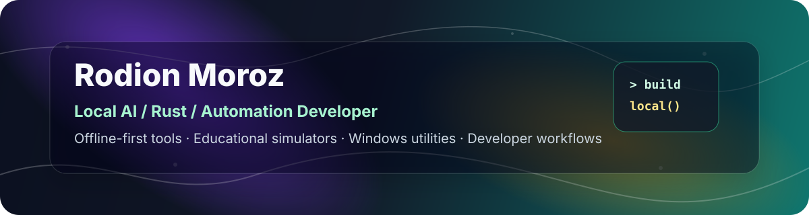
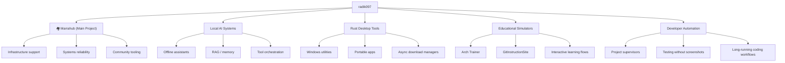

<div align="center">



<br />

<a href="https://github.com/radik097">
  
</a>

<br />

[](https://github.com/radik097)
[](#)
[](https://marrahub.com.au)
[](#)

</div>

---

## Navigation

<div align="center">

[](#-marrahub--main-project)
[](#featured-projects)
[](#tech-stack)
[](#interactive-map)
[](#github-activity)
[](#contact)

</div>

---

## 🏘️ Marrahub — Main Project

<div align="center">

<table>
<tr>
<td align="center">

### Marrahub

Community hub platform for **Marra Community Hub Incorporated** — the project I put most of my current engineering and infrastructure time into, through my IT Infrastructure Volunteer role.

**Focus:** real-world infrastructure support, systems reliability, and practical tooling for a working community organisation — not a sandbox project.

<a href="https://marrahub.com.au">
  
</a>
<a href="mailto:rodion.moroz@marrahub.com.au">
  
</a>

</td>
</tr>
</table>

</div>

---

## About

I'm an **IT Infrastructure Volunteer at Marrahub**, supporting real-world systems and infrastructure for a community organisation. Outside of that, I build **offline-first AI tools, Rust desktop utilities, educational simulators, and automation systems** as my own self-directed projects.

My current direction is practical engineering: tools that run locally, explain complex systems clearly, automate repetitive work, and turn experimental ideas into usable software.

```text
Local AI · Rust · Python · TypeScript · React · Vite · Windows Tools · Developer Automation
```

<details>
<summary><b>💬 Ask me about...</b></summary>

<br />

| Topic | What I'll talk your ear off about |
|---|---|
| 🏘️ Marrahub | Community infrastructure, day-to-day systems support, practical fixes |
| 🖥️ Rust desktop apps | Portable Windows tooling, Iced UI, async downloads |
| 🎓 Educational simulators | Turning complex systems into interactive lessons |
| 🤖 Local AI | Offline-first assistants, RAG, tool orchestration |

</details>

---

## Featured Projects

<table>
<tr>
<td width="50%" valign="top">

### 🏗️ Arch Trainer

Interactive browser-based sandbox for learning the Arch Linux installation process.

**Core idea:** terminal simulator + installation flow map + browser VM experiments.

**Stack:** React, Vite, TypeScript, v86, xterm, SQLite, Vitest, Playwright.

<a href="https://github.com/radik097/Arch_game">
  
</a>

</td>
<td width="50%" valign="top">

### 🎮 MCZ Launcher

Portable Windows-style launcher for Minecraft NeoForge modpacks.

**Core idea:** automatic downloads, JSON modpack configuration, Rust desktop app architecture.

**Stack:** Rust, Iced, Tokio, Windows portable app design.

<a href="https://github.com/radik097/MCZPlauncherv2">
  
</a>

</td>
</tr>

<tr>
<td width="50%" valign="top">

### 📚 GitInstructionSite

Interactive multilingual learning site for Git and GitHub fundamentals.

**Core idea:** explain Git/GitHub through simple terms, GUI/CLI workflows, and beginner-friendly lessons.

<a href="https://github.com/radik097/GitInstructionSite">
  
</a>

</td>
<td width="50%" valign="top">

### 🪟 Win2RayUI

Windows V2Ray client concept with automatic configuration and server parsing.

**Core idea:** practical Windows networking utility with clean UI direction.

<a href="https://github.com/radik097/Win2RayUI">
  
</a>

</td>
</tr>
</table>

---

## Tech Stack

<div align="center">


</div>

<details>
<summary><b>Open full stack matrix</b></summary>

| Area | Tools |
|---|---|
| Languages | Python, Rust, TypeScript, JavaScript |
| Frontend | React, Vite, HTML, CSS |
| Desktop | Rust GUI, Tauri direction, Windows-first portable tools |
| AI / Automation | Ollama, local LLM workflows, RAG concepts, ChromaDB direction |
| Testing | Vitest, Playwright, scripted validation |
| Data | SQLite, JSON configs, local-first storage |
| DevOps | GitHub Actions, portable builds, release packaging |
| Systems | Windows tooling, Linux learning environments, CLI workflows |
| Infrastructure | Community IT support, hardware/software troubleshooting (Marrahub) |

</details>

---

## Interactive Map

<details open>
<summary><b>Engineering direction map</b></summary>


```mermaid
flowchart TD
    A["radik097"] --> M["🏘️ Marrahub (Main Project)"]
    A --> B["Local AI Systems"]
    A --> C["Rust Desktop Tools"]
    A --> D["Educational Simulators"]
    A --> E["Developer Automation"]

    M --> M1["Infrastructure support"]
    M --> M2["Systems reliability"]
    M --> M3["Community tooling"]

    B --> B1["Offline assistants"]
    B --> B2["RAG / memory"]
    B --> B3["Tool orchestration"]

    C --> C1["Windows utilities"]
    C --> C2["Portable apps"]
    C --> C3["Async download managers"]

    D --> D1["Arch Trainer"]
    D --> D2["GitInstructionSite"]
    D --> D3["Interactive learning flows"]

    E --> E1["Project supervisors"]
    E --> E2["Testing without screenshots"]
    E --> E3["Long-running coding workflows"]
```

</details>

<details>
<summary><b>How I think about projects</b></summary>

```text
Idea
  ↓
Architecture
  ↓
Working prototype
  ↓
Validation scripts
  ↓
README + screenshots + release
  ↓
Clean public portfolio project
```

</details>

---

## Current Build Direction

- Supporting and growing **Marrahub** as my primary hands-on infrastructure project.
- Making experimental projects easier to understand from the outside.
- Turning rough tools into clean, documented repositories.
- Building local-first AI and automation systems.
- Improving Windows portable app packaging.
- Designing UI workflows that are practical, not just decorative.

---

## GitHub Activity

<div align="center">

[](https://github.com/radik097)

</div>

---

## Repository Quality Rules

<details>
<summary><b>What I want every public repository to contain</b></summary>

- Clear one-line description.
- Screenshot or demo link when UI exists.
- Installation instructions that actually match the repository.
- Tech stack section.
- Known limitations.
- Roadmap.
- No placeholder links.
- No unfinished AI Studio / template text.
- Clean public-facing README.

</details>

---

## Contact

For collaboration, project discussion, or technical feedback, use GitHub issues/discussions on the relevant repository — or reach me directly through **Marrahub**.

<div align="center">

[](https://marrahub.com.au)
[](mailto:rodion.moroz@marrahub.com.au)


**Building local tools, educational systems, and AI-assisted automation — with Marrahub as my main project.**

</div>
